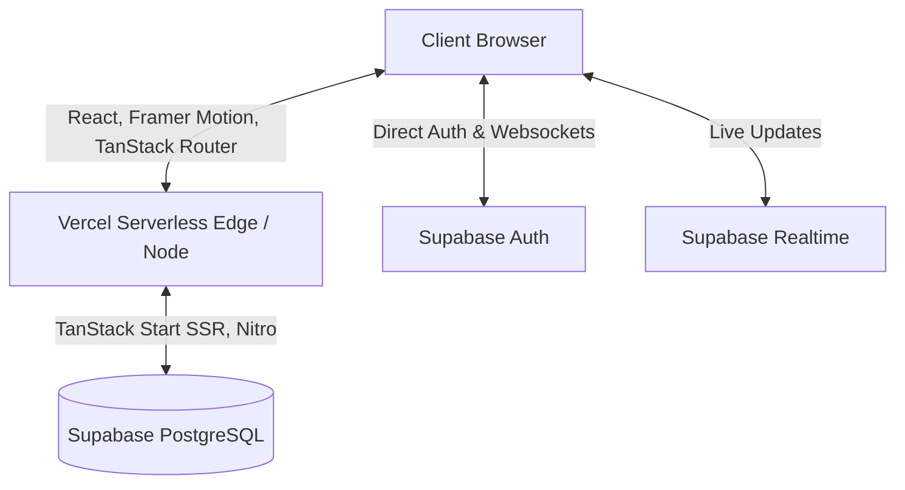

# PlateFull 🍽️

> Rescuing food, feeding the future. A real-time surplus rescue network connecting restaurants, NGOs, and everyday users to end food waste.

 <!-- Placeholder for a real banner -->

PlateFull is a premium platform built with **Vite, React, TanStack Start (SSR), and Supabase** that tackles food waste head-on. It provides a real-time marketplace where restaurants can post surplus food (either as donations or flash sales), and NGOs or users can claim them instantly.

## 🚀 Features

*   **Three distinct user roles:**
    *   **🧑 Everyday Users:** Discover heavily discounted meals from restaurants near you before they close.
    *   **🏪 Restaurants:** Turn surplus into impact. Push flash discounts or donate to verified NGOs. Track your impact on the leaderboard.
    *   **🤝 NGOs:** Get real-time alerts when partners have food to give. Claim, collect, and rate the quality.
*   **Real-time Network:** Built with Supabase Realtime to push new donations and claims instantly across the network without refreshing.
*   **Leaderboard & Reputation:** Restaurants build reputation through successful rescues and ratings, gamifying the food rescue process.
*   **3D Hero & Animations:** Immersive user experience with Framer Motion and `@react-three/fiber` 3D elements.
*   **Interactive Maps:** Powered by Leaflet to find donations geographically.

## 🏗️ Architecture

The application is built using a modern SSR (Server-Side Rendering) architecture:



## 🛠️ Tech Stack

*   **Frontend Framework:** React 19, Vite
*   **Routing & SSR:** TanStack Router, TanStack Start (Nitro)
*   **Backend & Database:** Supabase (PostgreSQL), Supabase Auth, Supabase Realtime
*   **Styling:** Tailwind CSS 4, Radix UI (Headless UI components)
*   **Animations:** Framer Motion, Three.js (`@react-three/fiber`)
*   **Mapping:** React Leaflet

## 🗄️ Database Schema

Our PostgreSQL schema features strict Row Level Security (RLS) to ensure data privacy:

*   **`profiles`**: Auto-created on signup via trigger.
*   **`user_roles`**: Links a user to their specific app role (`user`, `restaurant`, `ngo`).
*   **`restaurants`**: Stores restaurant details and impact stats (`meals_rescued`, `rating_sum`).
*   **`ngos`**: Stores NGO details and `meals_distributed`.
*   **`donations`**: The core marketplace table. Includes `kind` ('donation' or 'flash_sale'), `status` ('active', 'claimed', 'expired', 'collected'), and expiration timestamps.
*   **`ratings`**: NGO-to-Restaurant ratings, automatically updating restaurant reputation via database triggers.

## 💻 Local Development Setup

### 1. Clone the repository

```bash
git clone https://github.com/the-amanshaikh/PlateFull.git
cd PlateFull
```

### 2. Install dependencies

```bash
npm install
```

### 3. Configure Environment Variables

Create a `.env` file in the root directory and add your Supabase credentials:

```env
VITE_SUPABASE_URL="your-supabase-project-url"
VITE_SUPABASE_PUBLISHABLE_KEY="your-supabase-anon-key"
VITE_SUPABASE_PROJECT_ID="your-supabase-project-id"
SUPABASE_URL="your-supabase-project-url"
SUPABASE_PUBLISHABLE_KEY="your-supabase-anon-key"
SUPABASE_PROJECT_ID="your-supabase-project-id"
SUPABASE_SERVICE_ROLE_KEY="your-supabase-service-role-key"
```

### 4. Run the Development Server

```bash
npm run dev
```

The app will be available at `http://localhost:5173`.

## 🚢 Deployment

The project is optimized for deployment on Vercel. 
1. Connect your GitHub repository to Vercel.
2. Select the **Vite** preset (or let Vercel auto-detect).
3. Ensure you add all the Environment Variables listed above in the Vercel dashboard.
4. Set the Output Directory to `.output` (Vercel should auto-detect this for Nitro).
5. Deploy!

## 🤝 Contributing

Contributions are welcome! Please feel free to submit a Pull Request.

## 📄 License

This project is open-source and available under the MIT License.
